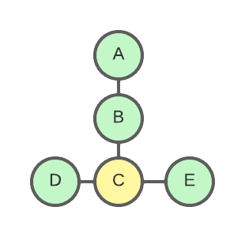

# The Mesh network

>_" A meshed network is a network in which every node is connected to every other node within that network. "_

## Translating mesh into code

PainlessMesh is a library that takes care of creating a mesh network using esp32 hardware. The goal is to allow the programmer to work with a mesh network without having to worry about how the network is structured or managed.
The Github Library can be found at <a href="https://gitlab.com/painlessMesh/painlessMesh">intro to painlessMesh</a>.

This library is written in C++ and can be managed with the Arduino Framework. 
It is derived from the <a href="https://docs.espressif.com/projects/esp-idf/en/stable/esp32/api-guides/esp-wifi-mesh.html">Espressif IDE platform</a>. 

This project is made with PlatformIO, a user-friendly and integrated development environment with a set of professional instruments to speed up and simplify the creation and delivery of embedded products. It can be configured inside Visual Studio Code through a simple extension.
More information can be find at <a href="https://platformio.org/platformio-ide">https://platformio.org/platformio-ide</a>.

## Communication Protocol

painlessMesh uses JSON objects for all its messaging and communication. 

JSON (JavaScript Object Notation) is a lightweight data-exchange format. It is easy for humans to read and write and easy for machines to parse and generate. 
A mesh-JSON example can be found in the next subject.

Because of this, the mesh can be easily integrated into (javascript) front-ends and other web applications. The downside to this is that it can have a minor performance decrease so binary messaging should be a nice upgrade. We did not have any issues with this.


## Installation of the painlessMesh Library
painlessMesh is included in both the Arduino Library Manager and the Platformio library registry.

### PlatformIO
Libraries > PainlessMesh by Scotty > install

After a successful installation _platform.ini_ should look something like the following:

```ini
[env:esp32dev]
platform = espressif32
board = esp32dev
framework = arduino
monitor_speed = 115200
lib_deps = 
 painlessmesh/painlessMesh@1.4.10
 marian-craciunescu/ESP32Ping@^1.7
 arkhipenko/Dictionary@^3.5.0
 ottowinter/ESPAsyncWebServer-esphome@^2.1.0
 sv-zanshin/BME680@^1.0.12

```
With the installation of the painlessMesh, the following extra library's will be installed automatically
- ArduinoJson
- TaskScheduler
- ESPAsyncTCP (ESP8266)
- AsyncTCP (ESP32)

In this project, we are working with the BMW680 sensor which is why it is included in the platformio.ini file.

### Arduino IDE 
Please follow <a href="https://docs.arduino.cc/software/ide-v1/tutorials/installing-libraries"> these </a> steps for install painlessMesh into Arduino IDE. 

Please install the following libraries
- PainlessMesh 
- ArduinoJson
- TaskScheduler
- ESPAsyncTCP (ESP8266)
- AsyncTCP (ESP32)

 
## Your First Mesh
A first mesh file would look something like <a href="https://gitlab.com/painlessMesh/painlessMesh/-/blob/develop/examples/basic/basic.ino">basic.ino</a>. This will do following things:

- Detect an incoming message
 - void receivedCallback( uint32_t from, String &msg ) {}
- Send a broadcast
 - void sendMessage() {}
- Detect a new connection
 - void newConnectionCallback(uint32_t nodeId) {}
- Detect a change in network structure
 - void changedConnectionCallback() {}
- Adjusted time frame
 - void nodeTimeAdjustedCallback(int32_t offset) {}

### Configuration of your first mesh
Make sure you include the following line in _main.cpp_:
```c++
#include <painlessMesh.h>
``` 
Also on top of the basic.ino file you may find a few defines. These can be set as you wish but these **need to be the same over the whole network**.
```c++
#define MESH_PREFIX "whateverYouLike"
#define MESH_PASSWORD "somethingSneaky"
#define MESH_PORT 5555
``` 

Around line 50 you can also find a function that looks simelar to this:
```c++
mesh.setDebugMsgTypes( ERROR | STARTUP ); 
```

There are a few nice arguments for this option. Here are a few I used in this project.
- **ERROR**: This will show all the errors in the configuration.
- **MESH_STATUS**: This argument will show the current status of your network.
- **CONNECTION**: This will show every step it takes to be connected to the network.
- **SYNC**: The nodes need to be in sync to perform broadcasts. This function will show the current synchronization of the network.
- **GENERAL**: This will show some general information about the network such as the current connected AP and IP (if configured)

REMOTE, MSG_TYPES were not used in this project.

In the loop function you can find the hart of the mesh, 
this will keep the mesh alive.
```c++
loop(){
 mesh.update();
} 
```
Try to avoid using delay() in your code. The mesh needs to perform a few tasks in the background and using delay() will stop these tasks from happening and can cause the mesh to lose stability. 

Instead we recommend using TaskScheduler which is used in painlessMesh itself. Full documentation can be found 
<a href="https://github.com/arkhipenko/TaskScheduler/wiki/Full-Document"> here </a>.

## A simple example overview
This example will be used over the whole documentation.

The painlessMesh assigns a node with a nodeID. 
For ease of use in this documentation, we will talk about these nodes as letters A, B, C, D, and E 

When we upload the <a href="https://gitlab.com/painlessMesh/painlessMesh/-/blob/develop/examples/basic/basic.ino">basic.ino</a> code with 5 nodes (A,B, C, D and E) the following structure will be configured automatically.

***Figure1:** Simple Mesh Example with 4 notes*

in JSON format the structure will look something like this.
Please note that the letters will be replaced with the corresponding nodeId in this format.

```json
{
 nodeId: C,
 subs{
  nodeId: A,
  nodeId: B,
  nodeId: D,
  nodeId: E
 }
}
```
The structure of this JSON will be explained later on in this documentation.

When a new node is found and connected to the mesh network it will add itself to the network structure.

### Broadcasting data to nodes in the network
As said in the example above, the mesh network can send a broadcast* to every node in the network.

To execute this with the painlessMesh library, we need to execute a function that looks like the following:
```
mesh.sendBroadcast(String messageToSend);
```

This will broadcast the variable messageToSend to every node connected to the network.
When received, the following messages will be displayed on the Serial Monitor of the other connected nodes.
```
startHere: Received from nodeID msg=messageToSend
```
This Message is generated by the receivedCallback() function.
>*_Broadcasting refers to the will of a data packet received by every connected device on the computer network, Wikipedia 2022_

### All the member functions
For all the Painlessmesh members I kindly refer to the <a href="https://gitlab.com/painlessMesh/painlessMesh/-/tree/develop#:~:text=be%20found%20here-,Member%20Functions,-void%20painlessMesh%3A%3Ainit">Painless Mesh Wiki</a>

## Some important remarks
- painlessMesh subscribes to the WiFi chip and events. Please be aware that the library can be incompatible with other programs/libraries that try to use the same chip.

- Try to be conservative in the number of messages. This is to prevent the hardware from overloading. The painlessMesh library tries to prevent this from happening.

- Messages can go missing or be dropped due to high traffic and you can not rely on all messages to be delivered.