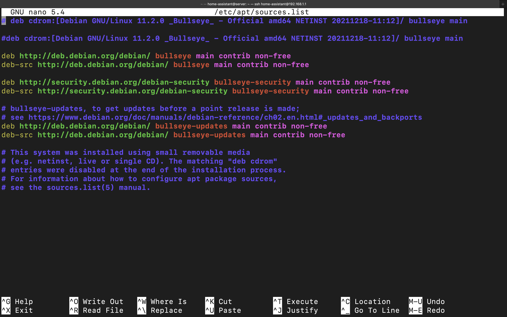
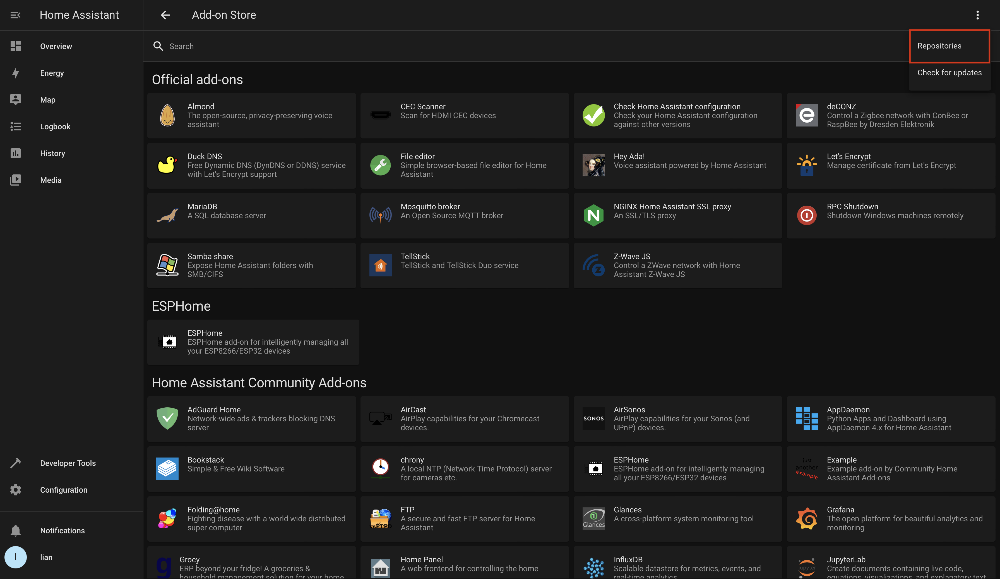
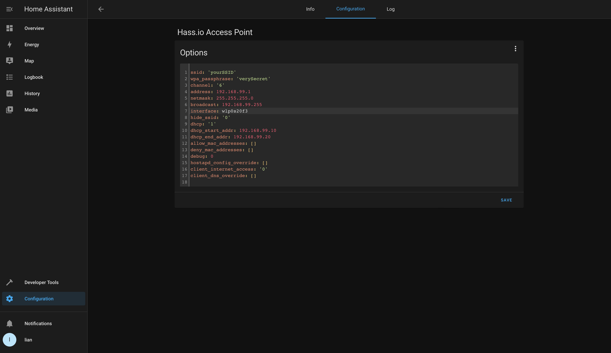

# How to install Home Assistant Supervised on a generic x86 machine.

Installing a supervised version of home assistant is only recommended for advanced users. Be sure to understand the <a href="https://github.com/home-assistant/architecture/blob/master/adr/0014-home-assistant-supervised.md">requirements</a> before installing. We need a Linux operating system to be able to install the supervisor. Debian is the preferred distribution for installing Home Assistant.

**For more information:** <a href="https://www.home-assistant.io/installation/">official Home Assistant installation guide</a>

## What we need:

- a suitable image for your machine. <a href="https://www.debian.org/distrib/netinst">find your image file here</a>
- USB flash drive
- flashing software for creating bootable USB drive (<a href="https://www.balena.io/etcher/">we used Balena Etcher</a>)
- internet connection, preferably wired.

## Install Debian:
Debian 11 (bullseye) is the current recommended release for installing Home Assistant. We will be using this version in this tutorial.
### Bios:

- disable secure boot
- enable boot from usb storage
- secure erase your internal storage

### Installation

Download a suitable image file and flash the image to your USB drive. Attach the drive to your system and power it on. Run through the installation wizard, everything speaks for itself.


<a href="https://www.debian.org/releases/stable/i386/ ">Detailed tutorial</a>

## Install Home Assistant:
### Add sudo user:

We will add our user to the sudo group to enable the sudo command. Open your terminal and enter these commands. Reboot to apply changes.
```
su -l
adduser home-assistant sudo
reboot
```

### Enable ssh server:

Now we can use our sudo rights to install the SSH server.
```
sudo apt-get update
sudo apt install openssh-server
```
The server should start automatically.
To check the status of the server:
```
sudo systemctl status ssh
```
starting and stopping the server:
```
sudo service ssh stop
sudo service ssh start
```
We should be able to connect remotely. To find the IP address you can use:
```
ip a
```

### Required packages:

Home Assistant depends on other packages during its installation. To install all these packages use:
```
sudo apt-get install \
jq \
wget \
curl \
udisks2 \
libglib2.0-bin \
network-manager \
dbus -y
```
Install docker:
```
curl -fsSL get.docker.com | sh
```
### Home Assistant OS AGENT

Be sure to use the <a href="https://github.com/home-assistant/os-agent/releases/tag/1.2.2">latest version</a>. **Adjust the link accordingly.**
```
wget os-agent_1.2.2_linux_x86_64.deb
sudo dpkg -i os-agent_1.2.2_linux_x86_64.deb
```
Check your installation:
```
gdbus introspect --system --dest io.hass.os --object-path /io/hass/os
```

Make sure to reboot your system before proceeding:
```
sudo reboot
```

### Install Home assistant

Make sure you have a stable internet connection! We discovered a DNS problem so we could not reach the Home Assistant server. We used tethering to get around this problem. 

You can ping 104.26.4.238 to check your connection to the Home Assistant servers.
```
wget https://github.com/home-assistant/supervised-installer/releases/latest/download/homeassistant-supervised.deb
sudo dpkg -i homeassistant-supervised.deb
```

Home Assistant should be up and running! 

You can follow the full onboarding tutorial here: <a href="https://github.com/home-assistant/os-agent/releases/tag/1.2.2">full onboarding tutorial</a> 

Your host machine might enter sleep mode after some time. To disable sleep mode use:
```
sudo systemctl mask sleep.target suspend.target hibernate.target hybrid-sleep.target
``` 

## Setting up the access point:

We are using this version of Home Assistant so we can install extra packages without losing them after an update of Home Assistant. We need the extra driver to enable our wifi card so we can create an access point. If we would use Home Assistant OS, we will have to do these steps again after every update.

Hostapd is a piece of software our addon needs to work.
```
sudo apt-get install hostapd
```
The iwlwifi (Intel Wireless wifi Link) package is non-free. Non-free packages don’t comply with the DFSG (Debian Free Software Guidelines). To install these packages we will have to edit the sources file.
```
sudo nano /etc/apt/sources.list
```
Here we append "contrib non-free" after every source link. 



Now we can install the drivers we need.
```
sudo apt update
sudo apt install firmware-iwlwifi
sudo reboot
ip a
```

Now you should see the wireless interface! In our case, the interface is called "wlp0s20f3". Remember this name!

Now we can go to Home Assistant to install the backup. Head over to the configurations page and click Add-ons, Backups, and Supervisor. In the add-on store, we can different add-ons. The addon we need is not listed because it is not an official Add-on. 



Here we can add extra repositories. Add this link:
```
https://github.com/mattlongman/hassio-access-point
```
The access point add-on should appear in the list of add-ons. Install the add-on and head over to the configuration tab. Configure your access point and don't forget to add the right interface name.



DHCP is highly recommended when using lots of nodes.
Save the configuration and start the add-on
check the logs, your access point should be up and running.
This can take a couple of minutes!

Now you have a working Home Assistant install and a working access point you can use to connect nodes to!