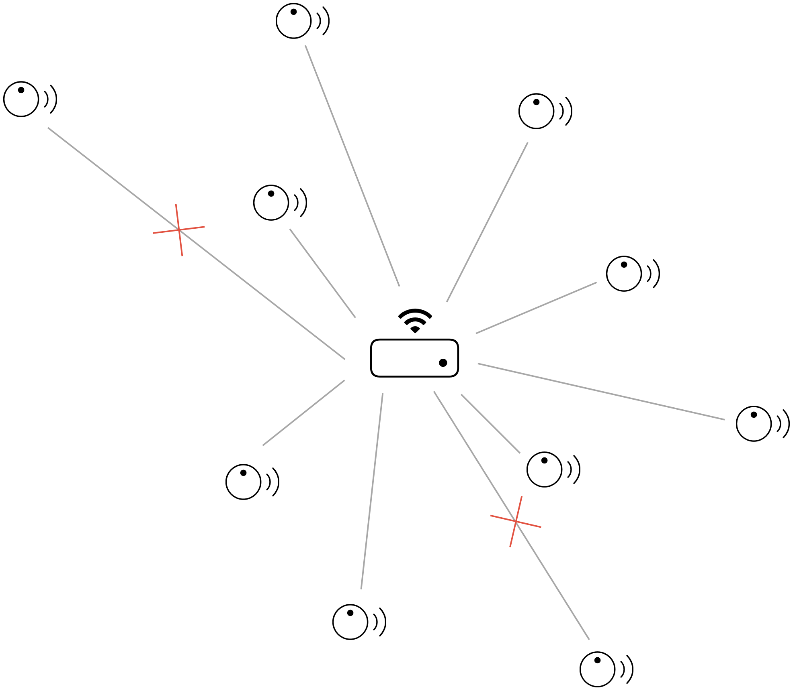
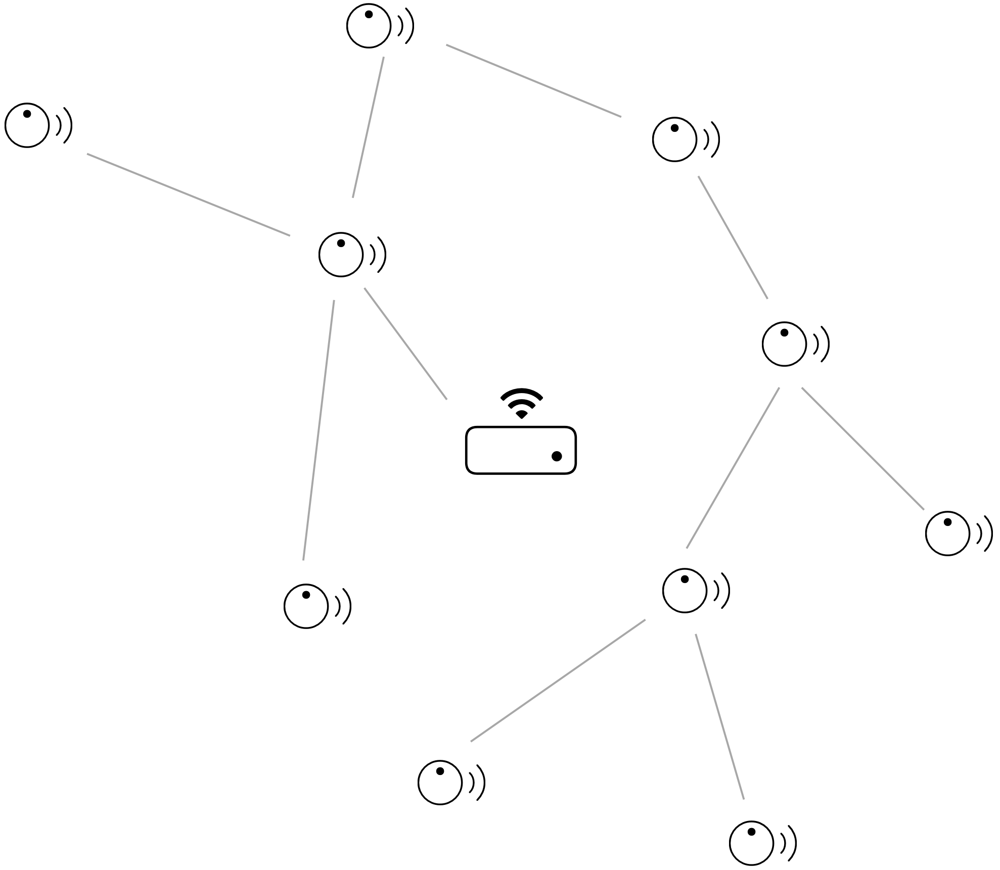
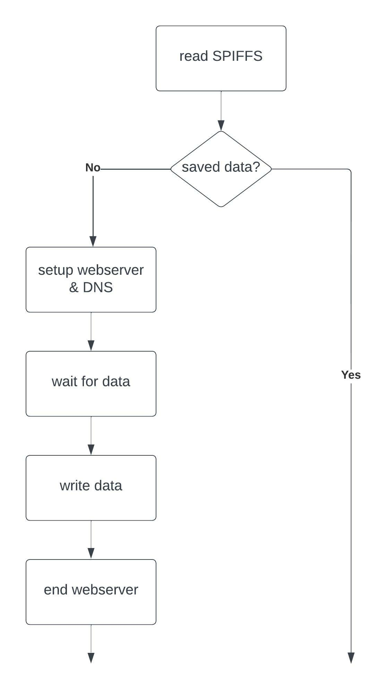
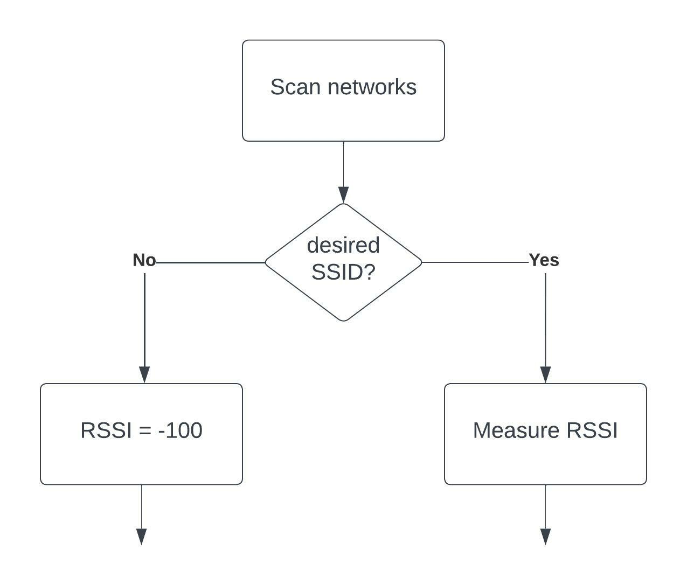
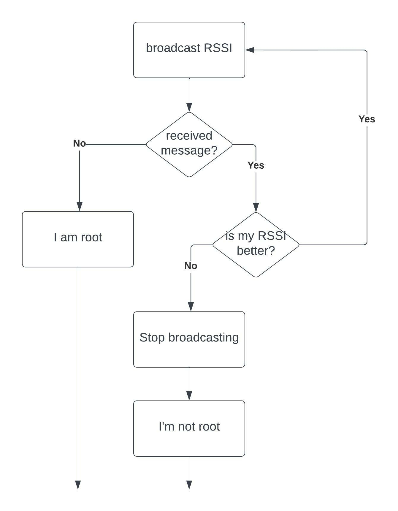

# Mesh Network of Environmental Sensors

The purpose of this project is to deploy classrooms with environmental sensors that measure metrics like temperature and humidity. Because of the large area that has to be covered, it is impossible to set up a conventional solution. The Wifi infrastructure of the school cannot be used for security reasons.

The solution to these problems is the deployment of a mesh network. The nodes in a mesh network don't only act as clients but also as repeaters. Every node will expand the network.

<a href="https://meshnetwork.sinners.be">Description of the code.</a>

Centralized architecture |Mesh architecture 
:-------------------------:|:-------------------------:
|

The painless mesh library enables us to set up this network without needing to worry about how the network is structured or managed. We only need to worry about our root node. The use of a root node is highly recommended and will improve the stability of the network. 

The root node can be used as a bridge to another network. This functionality is important so we can send our data to Home Assistant. We will use the REST API of Home Assistant to transfer the sensor data. Our root has to be selected based on the connection strength to the access point. 

# File layout

- main: main loop
- rd_22_280sensor: read bme280
- rd_22_680sensor: read bme680
- rd_22_api: setup the api and callback when a POST is received
- rd_22_mesh: send messages, 
- rd_22_node_class: 
- rd_22_setup_portal: read Spiffs, captive portal for setup
- rd_22_wifi: measure RSSI, connect to wifi, POST, deserialize json

# Necessary steps

1. Configuration of identifier
2. Measure RSSI to the access point
3. Setup mesh
4. Select a root
5. Connect to access point & setup API
6. Send measurements

## Extra functionality:

1. Reset the name with a button

## 1. Configuration of the identifier

Every node needs its unique identifier. It is important that this can be configured by the users of the sensors. To be able to set an identifier we set up a small access point and webserver on the ESP. When you connect to this access point you can enter a name in the captive portal. The configuration will be saved in the EEPROM so it is not lost when there is a loss of power.

Steps we execute:
- Read spiffs, if we have saved data we don't need the webserver
- setup the webserver and the DNS handler
- Wait for data submit
- Write the data to EEPROM
- End the webserver



### Dependencies:

<a href="https://github.com/me-no-dev/ESPAsyncWebServer">ESPAsyncWebServer</a>: We use this to be able to set up the webserver.

<a href="https://github.com/espressif/arduino-esp32/tree/master/libraries/DNSServer">DNSServer</a>: Used to make a captive portal. When you connect to the access point a webpage will pop up.

<a href="https://github.com/espressif/arduino-esp32/tree/master/libraries/SPIFFS">SPIFFS</a>: Used for reading and writing data in EEPROM.

## 2. Measure RSSI:

The Received Signal Strength Index (RSSI) is used to determine the best root node. The RSSI is the measurement of how strong the signal of a router or access point is to a device. The RSSI is a value between -100 and 0. An RSSI closer to 0 means a better connection. 

Steps we execute:
- Scan all networks
- Find the network with the SSID we want to connect to
- Measure the RSSI (when we have no connection we set the RSSI to -100)



### Dependencies:
<a href="https://github.com/espressif/arduino-esp32/tree/master/libraries/WiFi">WiFi</a>: To scan for networks and retrieve the RSSI.

## 3. Setup the mesh:

The mesh network uses its SSID and password. Every node that uses the same credentials will join the same mesh network. The use of delay() should be avoided. Using delay() will cause the mesh to fall apart.

The mesh.update() function should be executed as much as possible. When a message from the mesh network is received a callback will be executed. 

### Dependencies:

<a href="https://gitlab.com/painlessMesh/painlessMesh">painlessMesh</a>: Mesh library.

## 4. Select a root

When a mesh network is set up, a root has to be selected that will act as a bridge. All the nodes in the network will start broadcasting their RSSI values to each other. When a node receives a message with a better RSSI than its RSSI it will stop broadcasting its RSSI. Eventually, there will be only one node that is still broadcasting its RSSI. This node will be selected to be the root.

Steps we execute:
- Broadcast RSSI.
- When other nodes have a better RSSI stop broadcasting.
- When the node does not receive any more RSSI data declare himself as root.



### Dependencies:

<a href="https://gitlab.com/painlessMesh/painlessMesh">painlessMesh</a>: Mesh library.

## 5. Connect to access point

Only if the node is root!

When a node is declared as root it will connect to the access point. A REST API will also be set up so Home Assistant can send messages to the mesh network.

Connecting to the access point can be tricky because the mesh network is still running. Sometimes the connection fails, the node will be reset when this happens.

The root will start broadcasting a message telling all the nodes to send measurements to his address. This is also a message telling the nodes that the root is still alive.

### Dependencies:

<a href="https://github.com/espressif/arduino-esp32/tree/master/libraries/WiFi">WiFi</a>: For the connection to the access point.

<a href="https://github.com/espressif/arduino-esp32/tree/master/libraries/WebServer">WebServer</a>: Used for the REST API server.

<a href="https://arduinojson.org">ArduinoJson</a>: To deserialize the JSON message of the REST API.


## 6. Send measurements

All the nodes will read the sensor data and start sending their messages to the root node. The messages are specifically formatted to ease deserialization. When the root receives these messages they will be posted to Home Assistant. 

The JSON model we use is based on SenML which is designed for sending sensor data. This structure allows us to expand this Json without needing to change the deserialization function. Every part of the JSON is used for the POST request to Home Assistant.

- bn: Base name or sensor name (sensor1)
- n: Measurement name (temperature)
- u: Unit of Measurement (°C)
- v: Value (21.8)
```JSON
[
 {"bn": "sensor1", "n": "temperature", "u": "°C", "v": "25.6"},
 {"n": "humidity", "u": "%", "v":"69.42"},
 {"n": "pressure", "u": "Hpa", "v":"1016"}, 
 {"n": "chipID", "u": "ID", "v":"629348013"}, 
 {"n": "rootIP", "u": "", "v":"192.168.99.43"}
]
```

If the root loses its connection to Home Assistant it will stop broadcasting. In this case, all the nodes that stop receiving these messages will start selecting a new root.

### Dependencies:

<a href="https://github.com/Zanduino/BME680">Zanshin_BME680</a>: Read the sensor data if the BME680 is used.

<a href="https://github.com/adafruit/Adafruit_BME280_Library">Adafruit_BME280</a>: Read the sensor data if the BME6280 is used.

<a href="https://arduinojson.org">ArduinoJson</a>: To deserialize the JSON message of the mesh network.

<a href="https://github.com/espressif/arduino-esp32/tree/master/libraries/HTTPClient">HTTPClient</a>: Used for the POST request to Home Assistant.